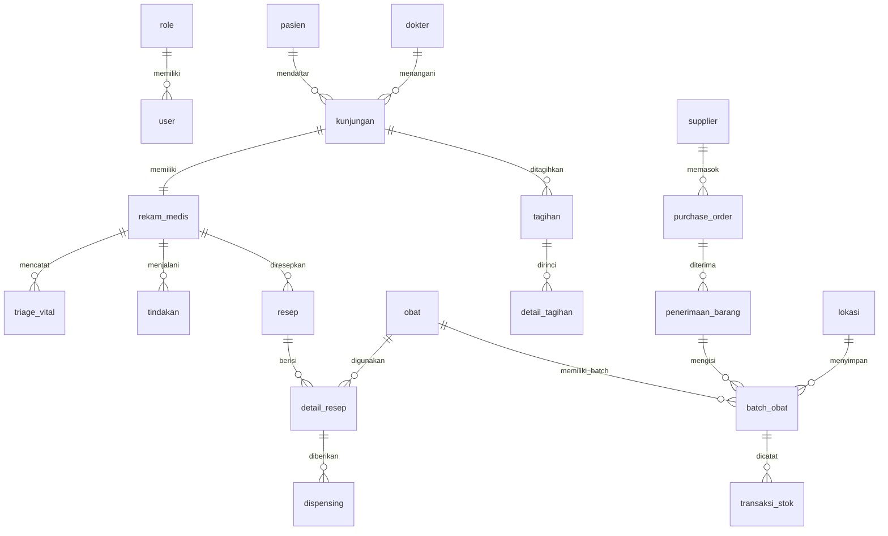

<p align="center">
  
  
  
  
  
</p>

# 🏥 Sistem Informasi Praktik Dokter Mandiri

> **Proyek Akhir Mata Kuliah Pemrograman SQL** — Sistem informasi berbasis web untuk mengelola seluruh aspek operasional klinik dokter mandiri, mulai dari pendaftaran pasien, rekam medis, farmasi, hingga keuangan.

---

## 📋 Deskripsi

Sistem Informasi Praktik Dokter Mandiri adalah aplikasi web full-stack yang dirancang untuk mendigitalisasi dan mengotomatisasi proses operasional sebuah klinik dokter mandiri. Aplikasi ini mencakup manajemen data pasien, penjadwalan kunjungan, pencatatan rekam medis, pengelolaan resep & dispensing obat, manajemen inventori farmasi, penagihan (billing), serta pelaporan internal.

Proyek ini dikembangkan secara bertahap dalam **5 tahap** yang mencerminkan penerapan konsep-konsep kunci Pemrograman SQL:

| Tahap | Fokus | Deskripsi |
|:-----:|-------|-----------|
| **1** | Database Design & Implementation | Perancangan skema database (20+ tabel), data master & operasional |
| **2** | DML, Query Kompleks & Views | Operasi CRUD, query multi-tabel, dan pembuatan views |
| **3** | Stored Programs | Stored procedures (8 prosedur) dan functions (5 fungsi) |
| **4** | Triggers | 8 trigger untuk audit log, validasi data, dan otomatisasi |
| **5** | Aplikasi Web | Antarmuka web PHP berbasis role dengan 13 modul operasional |

---

## ✨ Fitur Utama

### 🔐 Autentikasi & Otorisasi
- Sistem login berbasis session dengan role-based access control (RBAC)
- 4 role operasional utama: **Admin**, **Dokter**, **Apoteker**, **Kasir**
- Dashboard adaptif yang menampilkan modul sesuai otoritas pengguna

### 👥 Manajemen Data Master
- **Kelola Pasien** — CRUD data pasien lengkap (NIK, kontak, asuransi, kontak darurat)
- **Kelola Dokter** — Data dokter beserta SIP dan spesialisasi
- **Kelola Obat** — Katalog obat dengan kategori dan bentuk sediaan
- **Kelola Lokasi** — Manajemen lokasi penyimpanan (gudang, rak, ruangan)
- **Kelola User** — Manajemen akun pengguna sistem

### 🩺 Pelayanan Medis
- **Kelola Kunjungan** — Pendaftaran kunjungan dengan sistem antrian
- **Rekam Medis** — Pencatatan anamnesa, pemeriksaan fisik, vital signs, & catatan klinis
- **Kelola Resep** — Penulisan resep oleh dokter dengan detail obat & dosis

### 💊 Farmasi & Inventori
- **Dispensing** — Proses penyerahan obat dari resep ke pasien
- **Batch Obat** — Pelacakan batch obat berdasarkan tanggal kedaluwarsa & harga beli
- **Transaksi Stok** — Pencatatan keluar-masuk stok obat

### 💰 Keuangan
- **Kelola Tagihan** — Pembuatan tagihan per kunjungan dengan detail item
- **Detail Tagihan** — Rincian item tagihan dengan perhitungan otomatis via trigger

### 📊 Pelaporan
- **Laporan Kunjungan** — Statistik kunjungan berdasarkan periode
- **Laporan Pasien** — Data demografi dan riwayat pasien
- **Laporan Medis** — Ringkasan rekam medis
- **Laporan Keuangan** — Rekapitulasi pendapatan dan tagihan

---

## 🛠️ Tech Stack

| Komponen | Teknologi |
|----------|-----------|
| **Backend** | PHP 8.1 |
| **Web Server** | Apache 2.4 |
| **Database** | MySQL 8.0 |
| **Frontend** | Tailwind CSS (CDN), Bootstrap Icons |
| **Containerization** | Docker, Docker Compose |
| **DB Management** | phpMyAdmin |
| **Version Control** | Git, GitHub |

---

## 📁 Struktur Proyek

```
Proyek-Aplikasi-Praktek-Dokter/
├── config/
│   └── koneksi.php              # Konfigurasi koneksi database
├── database/
│   ├── THP1-Database.sql        # DDL — Skema tabel (20+ tabel)
│   ├── THP1-DataAwal.sql        # Data master (role, obat, dokter, pasien, dll.)
│   ├── THP1-DataOperasional.sql # Data operasional (kunjungan, resep, tagihan, dll.)
│   ├── THP2-DML-Queries-Views.sql # Views & query kompleks
│   ├── THP3-StoredPrograms.sql  # 8 stored procedures & 5 functions
│   └── THP4-Triggers.sql        # 8 triggers (audit, validasi, otomatisasi)
├── docs/
│   ├── INSTALLATION.md          # Panduan instalasi lengkap
│   └── dokumentasi.md           # Dokumentasi proyek
├── includes/
│   ├── header.php               # Header navigasi
│   ├── sidebar.php              # Sidebar menu berdasarkan role
│   └── footer.php               # Footer
├── modules/
│   ├── patients/                # CRUD Pasien
│   ├── doctors/                 # CRUD Dokter
│   ├── medicines/               # CRUD Obat
│   ├── visits/                  # CRUD Kunjungan
│   ├── medical-records/         # CRUD Rekam Medis
│   ├── prescriptions/           # CRUD Resep
│   ├── dispensing/              # CRUD Dispensing Obat
│   ├── locations/               # CRUD Lokasi Penyimpanan
│   ├── batches/                 # CRUD Batch Obat
│   ├── stock-transactions/      # CRUD Transaksi Stok
│   ├── billing/                 # CRUD Tagihan & Detail Tagihan
│   ├── users/                   # CRUD User
│   └── reports/                 # Laporan (Kunjungan, Pasien, Medis, Keuangan)
├── backup/                      # Direktori backup database
├── index.php                    # Dashboard utama
├── login.php                    # Halaman login
├── logout.php                   # Proses logout
├── Dockerfile                   # Image PHP 8.1 + Apache + mysqli
├── docker-compose.yml           # Orchestrasi 3 service (web, db, phpmyadmin)
└── .gitignore
```

---

## 🗃️ Skema Database

Database `praktik_dokter` terdiri dari **20+ tabel** yang dikelompokkan ke dalam 5 domain:



### Kelompok Tabel

| Domain | Tabel |
|--------|-------|
| **Master** | `role`, `user`, `pasien`, `dokter`, `obat`, `supplier`, `lokasi` |
| **Pelayanan Medis** | `kunjungan`, `rekam_medis`, `triage_vital`, `order_penunjang`, `hasil_penunjang`, `tindakan` |
| **Farmasi** | `resep`, `detail_resep`, `dispensing` |
| **Inventori** | `purchase_order`, `penerimaan_barang`, `batch_obat`, `transaksi_stok` |
| **Keuangan & Pelaporan** | `tagihan`, `detail_tagihan`, `report_agregasi`, `laporan_external`, `audit_log` |

---

## 🔑 Role & Hak Akses

| Role | ID | Modul yang Dapat Diakses |
|------|----|--------------------------|
| **Admin** | 1 | Semua modul (13 modul + Reports) |
| **Dokter** | 2 | Kunjungan, Rekam Medis, Resep, Reports |
| **Apoteker** | 3 | Obat, Resep, Dispensing, Lokasi, Batch Obat, Transaksi Stok |
| **Kasir** | 4 | Tagihan, Reports |

### Akun Default untuk Testing

| Role | Username | Password |
|------|----------|----------|
| Admin | `admin` | `admin123` |
| Dokter | `dandi` | `dokter123` |
| Apoteker | `asinta` | `apoteker123` |
| Kasir | `krina` | `kasir123` |

---

## 🚀 Quick Start

### Prasyarat

- [Git](https://git-scm.com/downloads)
- [Docker Desktop](https://www.docker.com/products/docker-desktop/) (termasuk Docker Compose)

### Instalasi

```bash
# 1. Clone repositori
git clone https://github.com/Kyuteela/Proyek-Aplikasi-Praktek-Dokter.git

# 2. Masuk ke direktori proyek
cd Proyek-Aplikasi-Praktek-Dokter

# 3. Bangun & jalankan kontainer
docker-compose up -d --build

# 4. Verifikasi kontainer berjalan
docker-compose ps
```

### Impor Database

Impor file SQL secara berurutan melalui terminal:

```bash
docker exec -i proyek-aplikasi-praktek-dokter-db-1 mysql -u root -proot123 praktik_dokter < database/THP1-Database.sql
docker exec -i proyek-aplikasi-praktek-dokter-db-1 mysql -u root -proot123 praktik_dokter < database/THP1-DataAwal.sql
docker exec -i proyek-aplikasi-praktek-dokter-db-1 mysql -u root -proot123 praktik_dokter < database/THP1-DataOperasional.sql
docker exec -i proyek-aplikasi-praktek-dokter-db-1 mysql -u root -proot123 praktik_dokter < database/THP2-DML-Queries-Views.sql
docker exec -i proyek-aplikasi-praktek-dokter-db-1 mysql -u root -proot123 praktik_dokter < database/THP3-StoredPrograms.sql
docker exec -i proyek-aplikasi-praktek-dokter-db-1 mysql -u root -proot123 praktik_dokter < database/THP4-Triggers.sql
```

Atau gunakan **phpMyAdmin** di `http://localhost:8081` untuk impor secara manual.

### Akses Aplikasi

| Layanan | URL | Kredensial |
|---------|-----|------------|
| **Aplikasi Web** | http://localhost:8080 | Lihat [Akun Default](#akun-default-untuk-testing) |
| **phpMyAdmin** | http://localhost:8081 | `root` / `root123` |
| **MySQL** | `localhost:3306` | `root` / `root123` |

### Menghentikan Aplikasi

```bash
# Hentikan kontainer (data tetap tersimpan)
docker-compose down

# Hentikan kontainer + hapus data database
docker-compose down -v
```

> 📖 Panduan instalasi lengkap tersedia di [`docs/INSTALLATION.md`](docs/INSTALLATION.md)

---

## ⚙️ Stored Programs

### Stored Procedures

| Prosedur | Parameter | Deskripsi |
|----------|-----------|-----------|
| `sp_transaksi_kunjungan` | IN, OUT | Membuat kunjungan baru dengan transaksi |
| `sp_buat_resep` | IN | Membuat resep baru untuk rekam medis |
| `sp_hitung_tagihan` | IN, OUT | Menghitung total tagihan per kunjungan |
| `sp_generate_report` | IN | Generate laporan kunjungan per periode |
| `sp_tambah_stok_obat` | IN | Menambahkan batch obat baru ke inventori |
| `sp_penerimaan_barang` | IN | Mencatat penerimaan barang dari PO |
| `sp_update_status_kunjungan` | IN | Mengubah status kunjungan |
| `sp_cari_pasien` | INOUT | Mencari data pasien berdasarkan nama |

### Functions

| Fungsi | Return Type | Deskripsi |
|--------|-------------|-----------|
| `fn_hitung_usia` | `INT` | Menghitung usia pasien berdasarkan tanggal lahir |
| `fn_total_tagihan` | `DECIMAL` | Menghitung total tagihan setelah diskon |
| `fn_cek_stok_obat` | `VARCHAR` | Mengecek ketersediaan stok obat |
| `fn_validasi_nik` | `VARCHAR` | Memvalidasi format NIK (16 digit) |
| `fn_jumlah_kunjungan` | `INT` | Menghitung total kunjungan per pasien |

---

## 🔔 Triggers

| Trigger | Event | Deskripsi |
|---------|-------|-----------|
| `trg_pasien_insert` | AFTER INSERT | Audit log saat pasien baru ditambahkan |
| `trg_rekam_medis_update` | AFTER UPDATE | Audit log saat rekam medis diperbarui |
| `trg_obat_delete` | AFTER DELETE | Audit log saat obat dihapus |
| `trg_validasi_nik` | BEFORE INSERT | Validasi NIK harus 16 digit |
| `trg_validasi_tagihan` | BEFORE INSERT | Validasi diskon tidak melebihi total tagihan |
| `trg_update_total_tagihan` | AFTER INSERT | Auto-update total tagihan saat detail ditambahkan |
| `trg_generate_rekam_medis` | BEFORE INSERT | Auto-generate tanggal catatan rekam medis |
| `trg_validasi_harga_beli` | BEFORE INSERT | Validasi harga beli obat > 0 |

---

## 👥 Tim Pengembang

<table>
  <tr>
    <td align="center"><b>Abner Benedict Javier Siahaan</b></td>
    <td align="center"><b>Aldeba Azka Kusmanto</b></td>
    <td align="center"><b>Derryl Smith Frans</b></td>
    <td align="center"><b>Mohamad Ardiatama Hibrizi</b></td>
    <td align="center"><b>Muhammad Ushaimm Mukmin Kasim</b></td>
  </tr>
</table>

---

## 📄 Lisensi

Proyek ini dibuat untuk keperluan akademis sebagai Proyek Akhir mata kuliah **Pemrograman SQL**, Program Studi Sistem Informasi.

---

<p align="center">
  <i>Dibuat dengan ❤️ untuk Proyek Akhir Pemrograman SQL — Genap 2025/2026</i>
</p>
